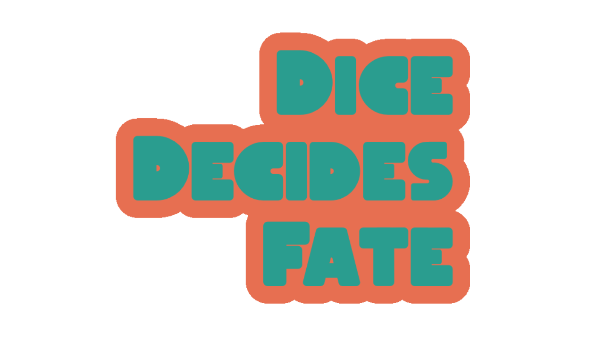

    

You are at the mercy of some dice in **Dice Decides Fate**, a game made for [GMTK Game Jam 2022](https://itch.io/jam/gmtk-jam-2022).

**How to play:**

-   **The Start** - The player gets 8 dice which are rolled to determine the amount of _Movement Money_.
-   **The Loop** - The player is allowed to choose how far to move. 1 step moved = $1 taken away.
-   **Spaces**
    -   **Free Spaces (Green)** - If you land here, nothing happens.
    -   **Trap Spaces (Red)** - If you land here, a dice is rolled to decide your fate.
        -   1 = +$10
        -   2 = -$1
        -   3 = -$2
        -   4 = -$3
        -   5 = -$4
        -   6 = Bankrupt
    -   **Yay Spaces** - If you land here, a dice is rolled to decide your fortune. Dice value times 4 is added to your _Movement Money_.
-   **The End** - The game is over when you find yourself in a state of bankruptcy.

---

[Itch.io](https://c1200.itch.io/dice-decides-fate)
